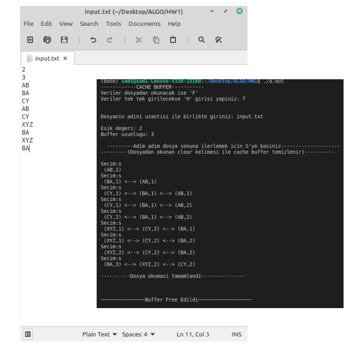
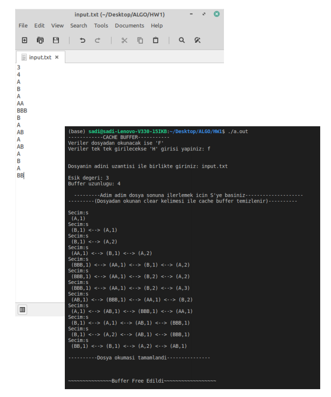

# Cache-Buffer
Creating a cache buffer on C Programming Language

### How It Works
  It reads the nodes from file and create a cache buffer. Steps can cleary seen here given examples.
  
  ###
  
  
